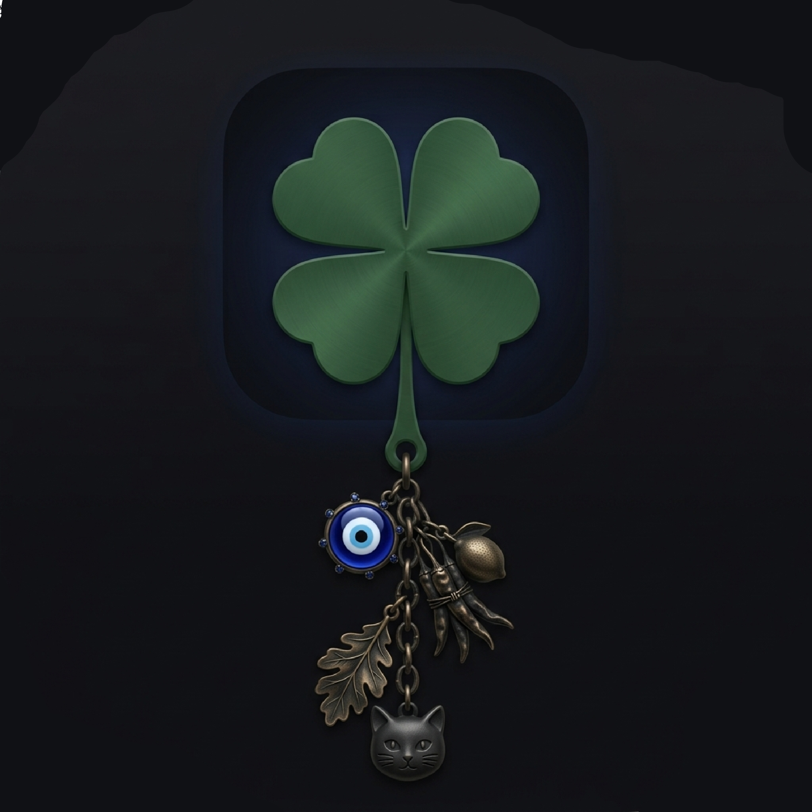

# 🍀 Aman Dangle

A physics-based interactive hanging charm desktop widget — built with React, Vite, and Electron.

Your charm sits in a transparent overlay on top of your desktop. Grab it, swing it, hover over it, and watch it react with real rope physics.



---

## ✨ Features

- **Real Verlet rope physics** — multi-node simulation, each segment is a particle constrained by distance
- **Grab & drag** — pick up any part of the rope or charm and fling it
- **Hover interaction** — moving your mouse near the charm gives it a gentle push
- **Idle sway** — subtle breathing motion when untouched
- **Multiple charms** — Nazar, Hamsa, Ghanta, Nimbu-Mirchi, and more
- **Customizable** — rope length, position, swing speed via control panel
- **Always-on-top transparent overlay** — charm floats above all windows
- **Click-through** — clicks pass through the transparent area to whatever is below

---

## 🚀 For End Users (Just want to use the app)

1. Go to the [**Releases**](../../releases) page
2. Download `AmanDangle-Setup.exe` (or the portable `.exe`)
3. Run it — no install required for the portable version

---

## 🛠️ For Developers (Run from source)

### Prerequisites
- [Node.js](https://nodejs.org/) v18 or later
- npm (comes with Node.js)

### Setup

```bash
# Clone the repo
git clone https://github.com/YOUR_USERNAME/aman-dangle.git
cd aman-dangle

# Install dependencies
npm install

# Run in development mode (browser preview)
npm run dev

# Run as Electron desktop app (development)
npm run electron:dev
```

### Build for production

```bash
# Build the Electron app (creates release/ folder)
npm run electron:build
```

The built app will be in `release/win-unpacked/AmanDangle.exe` (Windows).

---

## 📁 Project Structure

```
├── electron/          # Electron main process (overlay window, IPC)
├── src/
│   ├── components/    # React components (HangingCharm, ControlPanel)
│   ├── lib/           # Charm definitions & assets
│   └── store/         # Zustand state management
├── public/            # Static assets (charm images)
└── package.json
```

---

## 🎮 Controls

| Action | Result |
|---|---|
| **Drag** the rope or charm | Fling it like a real rope |
| **Hover** near the charm | Gentle push effect |
| **Right-click tray icon** | Open control panel |
| **Control panel** | Change charm, rope length, position, speed |

---

## 📝 License

MIT — feel free to fork and customize!
